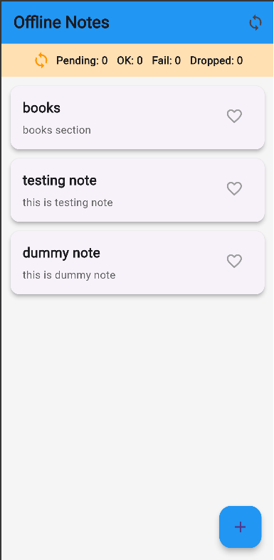
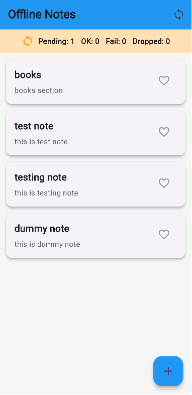
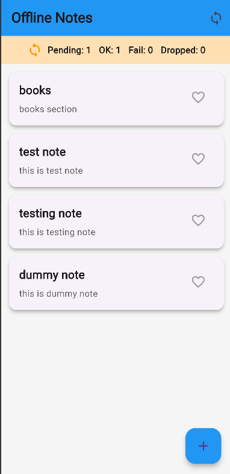
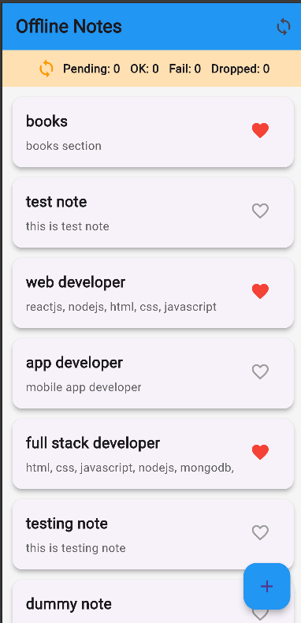
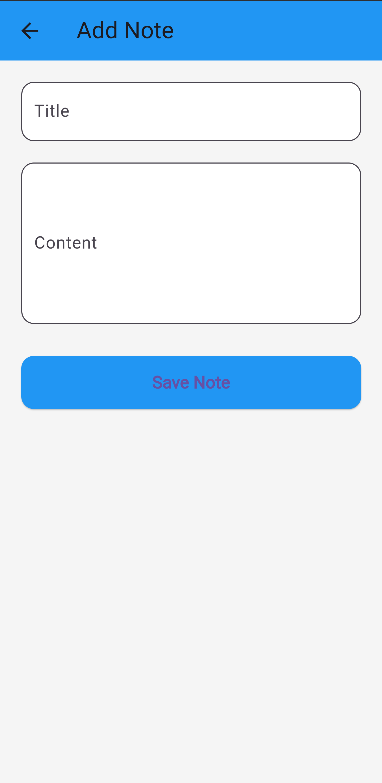

## Offline Sync Flutter Notes

This app demonstrates an **offline-first notes** experience with:

- **Local-first reads** via Hive
- **Offline writes** queued for later sync
- **Idempotent sync queue** with basic retry
- **Firebase Firestore** as a mock backend

### How it works

- **Local cache**: Notes are stored in a Hive box (`Note` model). UI always reads from Hive first.
- **Offline writes**: Adding a note or toggling like updates Hive immediately and enqueues a `SyncQueueItem`.
- **Queue persistence**: Queue is also a Hive box, so it survives app restarts.
- **Sync**: Press the sync icon in the app bar to process the queue once. On success, queue items are removed and we refresh from Firestore.
- **Idempotency**: Each queue item has an `idempotencyKey` derived from `(noteId, actionType, updatedAt)` to avoid duplicates on retry.
- **Conflicts**: We use **last-write-wins** based on `updatedAt` timestamps.

### Where to see data in Firebase Console

Notes are stored in **Cloud Firestore**, not Realtime Database.

1. Open [Firebase Console](https://console.firebase.google.com) → your project **flutter-project-8b5ef**.
2. Go to **Build → Firestore Database** (not "Realtime Database").
3. After adding a note and syncing (or after opening the app, which auto-syncs), open the **notes** collection. Each note is a document with id = note id; fields: `title`, `content`, `liked`, `updatedAt`.

### Running the app

1. Configure Firebase for the project (Android/iOS/Web) and ensure **Cloud Firestore** is enabled (see above).
2. Run:

```bash
flutter pub get
flutter run
```

### Verifying scenarios

- **Offline add note**:
  - Disconnect network (or stop Firebase emulator).
  - Add a note.
  - Note appears immediately; sync banner shows pending items.
  - Reconnect and tap the sync icon. Logs show queue processing and success.

- **Offline like toggle**:
  - Take a note offline.
  - Toggle like; UI updates instantly and queue size increases.
  - Reconnect and sync; Firestore reflects like state.

- **Retry scenario**:
  - Start with backend unavailable so sync fails once (see console logs for failure).
  - Bring backend up and sync again; idempotency ensures no duplicates.

### Observability

- Pending queue size is shown at the top of the list.
- `print` logs (tagged `[QUEUE]` and `[SYNC]`) show:
  - Enqueued actions
  - Sync attempts
  - Success/failure and dropped items after retries

### console logs

- Got object store box in database sync_queue_box.
- Got object store box in database notes_box.
- [SYNC] Starting queue processing: 0 items
- [QUEUE] Enqueued SyncActionType.likeToggle for note 3fb3c851-5b72-4c3f-8dd5-acfc87f73cda
- [QUEUE] Enqueued SyncActionType.create for note cbcaa397-ad85-4cbc-8a89-d1e843f32fce
- [SYNC] Starting queue processing: 2 items
- [SYNC] Success for 3fb3c851-5b72-4c3f-8dd5-acfc87f73cda-likeToggle-1773320345858
- [SYNC] Success for cbcaa397-ad85-4cbc-8a89-d1e843f32fce-create-1773320374527

### AI Prompt Log

1. **Prompt**: 
- How to implement offline sync queue in Flutter using Hive?
2. **Key response summary**: 
- Suggested queue manager and retry logic.
3. **Decision (Accepted/Rejected/Modified)**: 
- Accepted with modification.
4. **Why**: 
- Adjusted retry strategy to match assignment requirement.

### Screenshots

## App Screenshots











# offline_sync_flutter

## Getting Started

# Run Instructions

1. Clone repository

git clone <https://github.com/kanchan-shevkar/offline-sync-flutter.git>

2. Install dependencies

flutter pub get

4. Run app

flutter run
